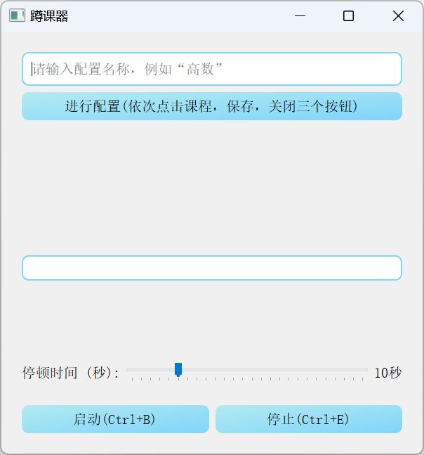
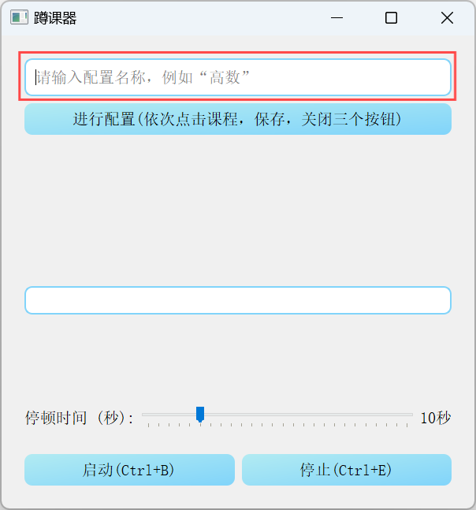
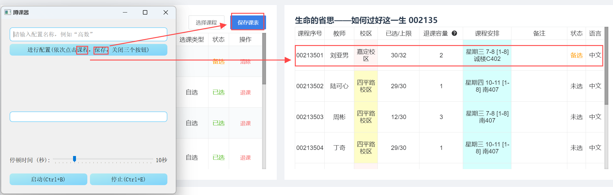
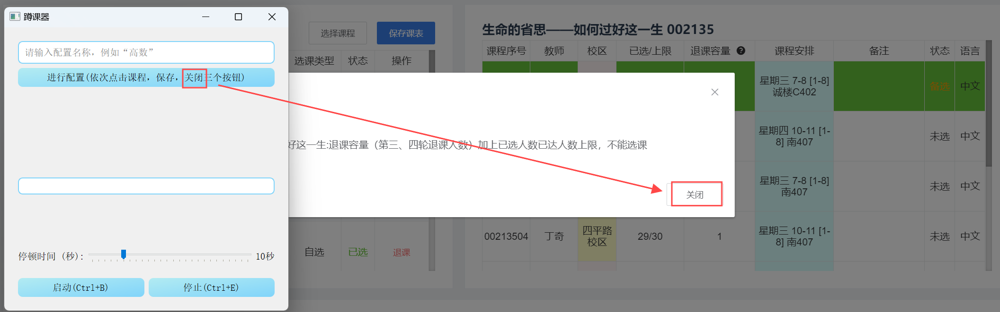
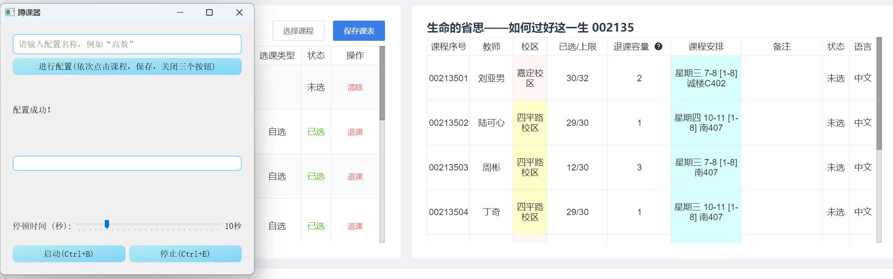
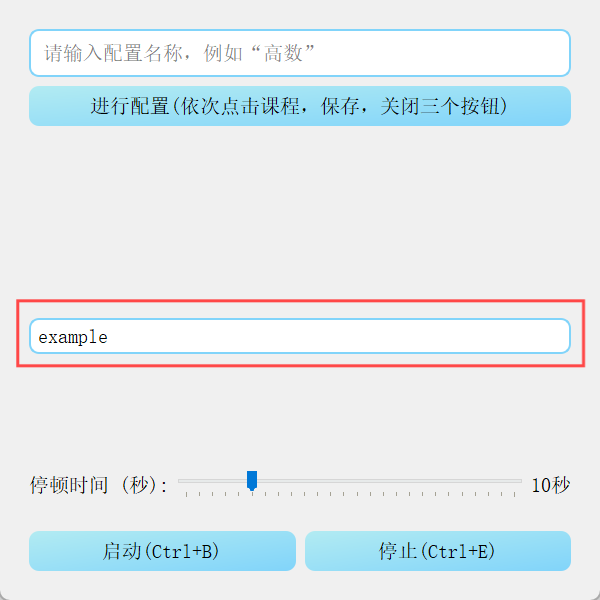
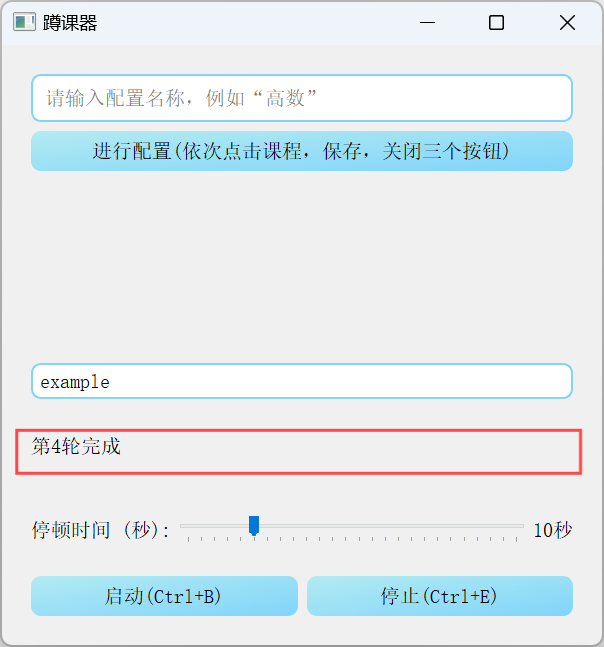
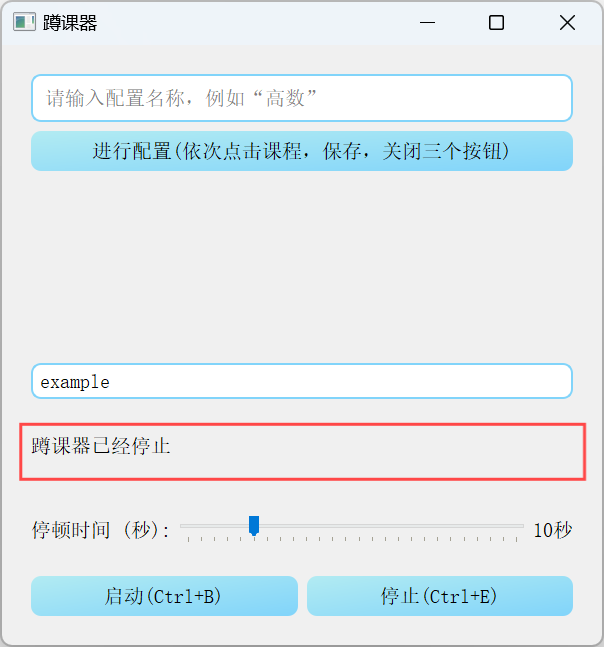

# 同济大学蹲课器v1.0.0

## 简介

由于选课机制的原因，课程容量有限，且发放时间通常是随机的，这导致学生们不得不花费大量时间和精力不断地刷新系统，以期望能够抢到心仪的课程。这种现象通常被称为“蹲课”，它不仅消耗了学生宝贵的时间和精力，还增加了学生们的焦虑感。为了帮助学生们更有效地选课，减少不必要的焦虑和时间浪费，同时也促进了一个更加公平和高效的教育环境。我们希望这款软件能够真正帮助到每一位使用者，让大家的选课更加从容不迫。

## 使用说明

### 1. 打开浏览器

首先，你需要打开你的浏览器，并登录到选课界面。

### 2. 配置脚本环境，并启动脚本

见[配置说明](##配置说明)部分

完成后，你将看到以下界面

<div align=center>
 
</div>

### 3. 配置脚本

1. 在“请输入配置名称”文本框中输入配置名称，例如“高数”。若不输入，则默认以当前时间生成配置文件名。
<div align=center>
 
</div>

2. 点击“进行配置(依次点击课程，保存，关闭三个按钮)”按钮,如下图：
<div align=center>
 
</div>

<div align=center>
 
</div>
  
3. 配置成功后，将有如下提示：
<div align=center>
 
</div>

### 4. 选择配置
1. 点击“中间的框”（发现这里忘记放提示了，之后改），选择或者输入你刚刚配置的配置文件
<div align=center>
 
</div>

### 5. 蹲课

1. 点击“启动”按钮（也可以按下Crtl+B），程序将开始蹲课。
<div align=center>
 
</div>

2. 点击“停止”按钮（也可以按下Crtl+E），程序将结束蹲课。
<div align=center>
 
</div>

## 配置说明

### 1. 安装

首先，你需要安装Python环境。你可以从Python官方网站下载并安装最新版本的Python。

### 2. 下载代码

你可以通过以下命令将代码下载到本地：

```bash
git clone 
```

或者直接下载压缩包

### 3. 配置虚拟环境

在项目根目录下创建一个虚拟环境：

```bash
python -m venv venv
```

激活虚拟环境：

```bash
source venv/bin/activate
```

### 4. 安装依赖

在虚拟环境中安装所需的依赖：

```bash
pip install -r requirements.txt
```

或者执行命令
```bash
pip install PyQt5>=5.15 pyautogui>=0.9.53 keyboard>=0.13.5 pynput>=1.7.3
```

### 5. 运行程序

直接双击`双击我运行！.bat`文件即可运行程序。


